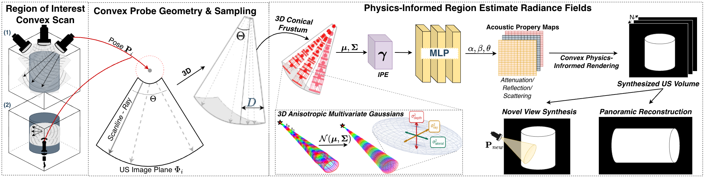
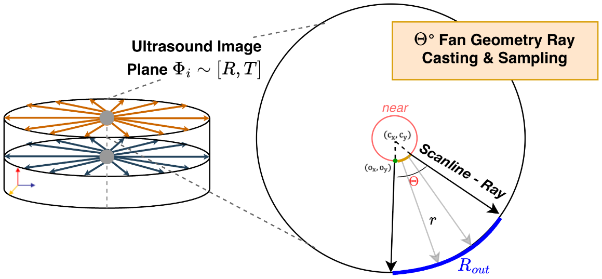
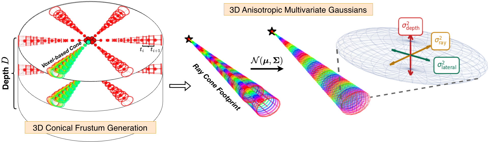

<div align="center">

# Ultra-Wide-NeRF: Multivariate Gaussian NeRF for Wide Field-of-View Ultrasound Reconstruction

**Accepted at the ASMUS Workshop, MICCAI 2026**

<a href="mailto:patris.valera@tum.de">Patris Valera</a><sup>1</sup><sup>⋆</sup>, <a href="mailto:magdalena.wysocki@tum.de">Magdalena Wysocki</a><sup>1,2</sup><sup>⋆</sup>, <a href="mailto:felix.duelmer@tum.de">Felix Duelmer</a><sup>1,2</sup>, <a href="mailto:mf.azampour@tum.de">Mohammad Farid Azampour</a><sup>1,2</sup>, <a href="mailto:sebastian.herz@lumavision.com">Sebastian Herz</a><sup>3</sup>, <a href="mailto:stefan.woerz@lumavision.com">Stefan Wörz</a><sup>3</sup>, <a href="mailto:nassir.navab@tum.de">Nassir Navab</a><sup>1,2</sup>

<sup>1</sup> Chair for Computer Aided Medical Procedures (<a href="https://www.cs.cit.tum.de/camp/start/">CAMP</a>), Technical University of Munich, Germany<br>
<sup>2</sup> Munich Center for Machine Learning (<a href="https://mcml.ai">MCML</a>), Munich, Germany<br>
<sup>3</sup> <a href="http://www.lumavision.com">LUMA Vision</a>, Dublin, Ireland<br>
<sup>⋆</sup> Equal contribution

[📄 Paper (arXiv)](https://arxiv.org/abs/2604.24187)

</div>

<p align="center">
  
</p>

Ultra-Wide-NeRF reconstructs wide field-of-view (WFoV) 3D ultrasound from overlapping sweeps of a convex probe. Stitching such sweeps together usually introduces compounding artifacts and aliasing, because the diverging beam changes resolution with depth. Ultra-Wide-NeRF models this beam geometry explicitly: it casts cones through a convex fan and approximates each cone segment by an anisotropic multivariate 3D Gaussian. The result is a continuous neural representation of the tissue that can be rendered from arbitrary virtual trajectories, for panoramic reconstruction and novel view synthesis. In the paper, the method is validated for intracardiac echocardiography (ICE) on phantom and porcine data.

## Table of Contents

- [Method](#method)
- [Repository Structure](#repository-structure)
- [Installation](#installation)
- [Data](#data)
- [Configuration](#configuration)
- [Training](#training)
- [Rendering and Evaluation](#rendering-and-evaluation)
- [Experimental Features](#experimental-features)
- [Acknowledgements](#acknowledgements)
- [References](#references)
- [License](#license)
- [Citation](#citation)

## Method

**Convex probe geometry.** Each ultrasound image is modelled as a fan of scanlines between an inner and an outer radius, with an opening angle Θ of up to 360° (for example, a rotating ICE probe). In 3D mode, one training sample is a stack of D such fan slices, each with its own pose.

<p align="center">
  
</p>

**Cone tracing with multivariate Gaussians.** Every scanline is cast as a cone, and each cone segment is approximated by an anisotropic 3D Gaussian 𝒩(μ, Σ). Its covariance has separate variances along the ray, laterally, and in elevation, which correspond to the three resolution axes of ultrasound. The Gaussians are encoded with integrated positional encoding (IPE), as in mip-NeRF [2].

<p align="center">
  
</p>

**Physics-based rendering.** Instead of colour and density, the MLP predicts acoustic properties for every Gaussian: attenuation, reflection and scattering amplitude. As in Ultra-NeRF [1], these maps are combined along each ray into a B-mode intensity, using the energy that remains after attenuation and reflection.

**Losses.** Training starts with an L2 loss. After a warm-up, it switches to SSIM + L2 and adds a gradient-magnitude loss and optional regularization: local normalized cross-correlation between the acoustic maps, and smoothness of the reflection along depth.

## Repository Structure

```
ultra-wide-nerf/
├── run_ultranerf.py                 # Training
├── evaluate_ultranerf.py            # Rendering from a checkpoint and metrics
├── reconstruct_from_subsampled.py   # Interpolates volumes rendered with depth subsampling
├── unerf_config.py                  # All options (config file and command line)
├── convex_configuration.py          # Shared convex-geometry settings
├── model.py                         # NeRF MLP
├── nerf_utils.py                    # Model creation, ray batching, losses, regularization
├── sampling.py                      # Convex ray generation and image remapping
├── render_rays_us_mip_combined.py   # Cone casting, multivariate Gaussians, IPE
├── rendering.py                     # Physics-based ultrasound rendering
├── evaluation_metrics.py            # Volume and slice metrics
├── dataset_utils/
│   ├── data_loader.py               # Multi-volume loading and train/val/test splits
│   ├── load_us.py                   # Data loading entry point used by training
│   ├── compute_trajectory_poses.py  # Builds a panoramic trajectory from several volumes
│   └── visualize_pose.py            # Plots the poses of a dataset
├── configs/                         # Configuration files
├── slurm/                           # SLURM and shell job templates
├── docs/                            # Figures
└── data/                            # Place your data here (not included)
```

## Installation

The code needs Python 3.11 and PyTorch 2.0 or newer. A CUDA GPU is strongly recommended for training.

```bash
git clone https://github.com/patrisvalera/ultra-wide-nerf.git
cd ultra-wide-nerf

conda create -n ultra_wide_nerf python=3.11
conda activate ultra_wide_nerf

# Install PyTorch for your CUDA version first: https://pytorch.org/get-started/locally/
pip install -r requirements.txt
```

## Data

> The phantom and porcine ICE data used in the paper cannot be shared. To use the code, prepare your own data in the format below.

### Directory layout

Put each acquisition (volume) in its own folder named `volume<number>`. The number is used to select volumes for the train, validation and test splits.

```
data/my_dataset/
├── volume0/
│   ├── images.npy
│   └── poses.npy
├── volume1/
│   ├── images.npy
│   └── poses.npy
└── ...
```

### Format

| File | Shape | Content |
|------|-------|---------|
| `images.npy` | `[D, H, W]` | D B-mode slices of one volume, any intensity range |
| `poses.npy` | `[D, 4, 4]` or `[D, 3, 4]` | One pose per slice, mapping the slice's local frame to world coordinates |

- **Units:** pose translations are in millimetres. They are converted to metres when loaded.
- **Slice frame:** the fan lies in the local x–y plane of each slice.
- **Fan and image:** the fan is scaled to the full image extent, so its bounding box must match the image. For a 360° fan, the outer circle touches the image borders.
- **3D mode (`full_volume_mode`):** all volumes must have the same shape `[D, H, W]`, because they are stacked for training.
- **2D mode:** the slices of all volumes are used as independent images.
- **Normalization:** images are scaled to [0, 1] over the whole dataset at load time.

To check the poses of a dataset before training:

```bash
python dataset_utils/visualize_pose.py --folder data/my_dataset --output poses.png
```

## Configuration

Options can be set in a config file (see [`configs/`](configs/)) or on the command line; the command line takes precedence. Run `python run_ultranerf.py --help` for the full list.

| Config | Mode |
|--------|------|
| [`config_convex.txt`](configs/config_convex.txt) | 3D volumes with multivariate Gaussians (main configuration) |
| [`config_convex_3D_mip.txt`](configs/config_convex_3D_mip.txt) | 3D volumes with multivariate Gaussians, L2 loss |
| [`config_convex_3D.txt`](configs/config_convex_3D.txt) | 3D volumes with point sampling |
| [`config_convex_2D.txt`](configs/config_convex_2D.txt) | Single 2D slices with point sampling |

The most important options:

| Option | Meaning | `config_convex.txt` |
|--------|---------|---------------------|
| `convex_fan_angle` | Full opening angle of the fan in degrees | `360` |
| `convex_big_radius`, `convex_small_radius` | Outer and inner radius of the fan in pixels | `308.5`, `19.16` |
| `convex_n_rays` | Scanlines per fan slice | `250` |
| `convex_n_samples` | Samples (Gaussians) per scanline | `308` |
| `full_volume_mode` | Train on stacks of D slices instead of single slices | `True` |
| `use_mip` | Cone casting with multivariate Gaussians and IPE | `True` |
| `mip_voxel_radius_lateral`, `mip_voxel_radius_depth` | Base radius of the Gaussians laterally and in elevation | `0.173`, `0.554` |
| `loss`, `ssim_lambda` | Loss after warm-up; SSIM weight (L2 gets `1 - ssim_lambda`) | `ssim`, `0.1` |
| `gradient_loss_weight` | Weight of the gradient-magnitude loss | `0.1` |
| `reg`, `r_lcc_penalty`, `reflection_smoothness_weight` | Regularization and its weights | `True`, `0.001`, `0.2` |
| `r_warm_up_it` | Iterations with L2 only, before the other terms are switched on | `10000` |

## Training

```bash
python run_ultranerf.py \
    --config configs/config_convex.txt \
    --datadir data/my_dataset \
    --basedir logs/my_experiment \
    --train_volumes "0,1,2,3" \
    --val_volumes "4" \
    --test_volumes "5" \
    --output_ch 3 \
    --chunk 40000 \
    --tensorboard
```

- **Splits:** `--train_volumes`, `--val_volumes` and `--test_volumes` accept comma-separated volume numbers (`"0,20,110"`), a single number, or `all`, `even`, `odd` and `last`. Without them, in 3D mode the last volume is used for testing, the second-to-last for validation and the rest for training.
- **Validation:** a validation volume is rendered every `--i_print` iterations; test volumes are not used during training.
- **Output channels:** `--output_ch 3` predicts attenuation, reflection and scattering amplitude. Pass the same value to the evaluation script.
- **Memory:** `--chunk` is the number of rays processed at once. Lower it if you run out of GPU memory; in 3D mode it must be a multiple of `convex_n_rays`.
- **Resuming:** training resumes from the latest checkpoint in the experiment folder, or from `--ft_path`.
- **Seed:** `--random_seed` (default `42`) seeds NumPy, PyTorch and Python.

A SLURM template is in [`slurm/train_ultranerf_multivol.slurm`](slurm/train_ultranerf_multivol.slurm). It saves a copy of itself with every job, so each run keeps its exact settings.

Training writes to `<basedir>/<expname>/` (`expname` is `ice` in the provided configs):

| Output | Content |
|--------|---------|
| `010000.tar`, ... | Checkpoints, every `--i_weights` iterations |
| `args.txt`, `config.txt` | All options and the config file used |
| `split_info.json` | Train, validation and test volumes |
| `train_rendering/`, `eval_rendering/` | Renderings of training and validation volumes; with `save_volume`, also the rendered volumes and their metrics |

TensorBoard logs are written to `<basedir>/summaries/` when `--tensorboard` is set:

```bash
tensorboard --logdir logs/my_experiment/summaries
```

## Rendering and Evaluation

`evaluate_ultranerf.py` renders a trained model from any set of poses. With a target volume, it also computes metrics.

```bash
python evaluate_ultranerf.py \
    --config configs/config_convex.txt \
    --ft_path logs/my_experiment/ice/300000.tar \
    --poses_path data/my_dataset/volume5/poses.npy \
    --target_path data/my_dataset/volume5/images.npy \
    --output_dir results/volume5 \
    --output_ch 3 \
    --chunk 40000
```

- `--ft_path` (required) is the checkpoint to evaluate. Use the same config, `--output_ch` and a `--chunk` that is a multiple of `convex_n_rays`, as for training.
- `--poses_path` has shape `[D, 4, 4]` for one volume or `[N, D, 4, 4]` for several, with translations in millimetres like the training data.
- `--target_path` (optional) has shape `[D, H, W]` or `[N, D, H, W]`. Without it, the script only renders.

**Metrics.** With a target and `save_volume` enabled, the script computes the following metrics, both on the full volume and on its middle coronal and axial slices: MSE, MAE, RMSE, NRMSE, PSNR, SSIM, LPIPS, SNR, Pearson correlation, mutual information (MI) and normalized MI. Prediction and target are each min-max normalized to [0, 1] before the metrics are computed.

**Outputs** in `--output_dir`: `renderings/volume_eval_<i>.npy` (rendered volume), slice and middle-cut PNGs, `renderings/metrics_eval_<i>.txt` and `.npy` (with a target), and `evaluation_summary.npz`.

### Panoramic reconstruction

To render one continuous panorama across several volumes, first combine their poses into a trajectory without overlaps, then render it:

```bash
python dataset_utils/compute_trajectory_poses.py \
    --data_folder data/my_dataset \
    --volumes "0,1,2,3" \
    --axis z

python evaluate_ultranerf.py \
    --config configs/config_convex.txt \
    --ft_path logs/my_experiment/ice/300000.tar \
    --poses_path data/my_dataset/trajectory_poses.npy \
    --output_dir results/panorama \
    --output_ch 3 \
    --chunk 40000
```

The trajectory is saved as `trajectory_poses.npy` in the data folder, together with a plot. `--axis` is the axis along which the volumes are ordered. `--overlap_strategy` (`next_to_prior`, `last_to_first` or `bidirectional`) decides which volume keeps the poses where volumes overlap.

### Faster rendering with depth subsampling

`--subsample_depth_every_n N` renders only every N-th slice of each volume. `reconstruct_from_subsampled.py` then interpolates the missing slices:

```bash
python evaluate_ultranerf.py \
    --config configs/config_convex.txt \
    --ft_path logs/my_experiment/ice/300000.tar \
    --poses_path data/my_dataset/volume5/poses.npy \
    --output_dir results/volume5_x2 \
    --output_ch 3 \
    --chunk 40000 \
    --subsample_depth_every_n 2

python reconstruct_from_subsampled.py --eval_dir results/volume5_x2 --use_slice_by_slice
```

Leave out `--target_path` here: the subsampled rendering has fewer slices than the target. The reconstructed volumes are written to `results/volume5_x2/reconstructed/`.

With `--use_slice_by_slice`, the slices are interpolated linearly along depth. Without it, the script uses 3D interpolation (`--method linear`, `nearest` or `cubic`), which needs much more memory.

SLURM templates for evaluation and trajectory computation are in [`slurm/`](slurm/).

## Experimental Features

The following options exist in the code but are **not part of the paper** and are not supported end to end:

- **Concentric-circle sampling** (`--sampling_strategy concentric_circles`) and **radial path integration** (`--use_radial_path_mode`). The ray generation is implemented; rendering and evaluation are incomplete, and radial path rendering raises `NotImplementedError`.
- **Spherical volume mode** (`--use_spherical_volume`), with rays that diverge in elevation instead of stacking parallel slices. The ray generation is implemented but not connected to training.
- **Elongated Gaussians** (`--use_elongation`), which stretch the Gaussians sideways with distance from the fan centre.
- **Linear probe mode** (without `--use_convex_mode`), inherited from Ultra-NeRF; it is not tested in this repository.

## Acknowledgements

This work builds on [Ultra-NeRF](https://arxiv.org/abs/2301.10520) [1] and on the integrated positional encoding of [mip-NeRF](https://arxiv.org/abs/2103.13415) [2]. The code was developed as part of the Master's thesis of Patris Valera at the Technical University of Munich (TUM) at the Chair for Computer Aided Medical Procedures (CAMP).

We thank the [Interdisciplinary Research Laboratory (IFL) of CAMP](https://www.cs.cit.tum.de/en/camp/labs-locations/ifl-lab/) and [LUMA Vision](https://www.lumavision.com).

## References

1. M. Wysocki, M. F. Azampour, C. Eilers, B. Busam, M. Salehi, and N. Navab. "Ultra-NeRF: Neural Radiance Fields for Ultrasound Imaging". In: *Medical Imaging with Deep Learning*. PMLR, 2024, pp. 382–401. [arXiv](https://arxiv.org/abs/2301.10520)
2. J. T. Barron, B. Mildenhall, M. Tancik, P. Hedman, R. Martin-Brualla, and P. P. Srinivasan. "Mip-NeRF: A Multiscale Representation for Anti-Aliasing Neural Radiance Fields". In: *Proceedings of the IEEE/CVF International Conference on Computer Vision*. 2021, pp. 5855–5864. [arXiv](https://arxiv.org/abs/2103.13415)

## License

This project is licensed under the Apache License 2.0; see [LICENSE](LICENSE).

## Citation

If you use this code, please cite:

```bibtex
@article{valera2026ultrawidenerf,
  title   = {Multivariate Gaussian NeRF for Wide Field-of-View Ultrasound Reconstruction},
  author  = {Valera, Patris and Wysocki, Magdalena and Duelmer, Felix and Azampour, Mohammad Farid and Herz, Sebastian and W{\"o}rz, Stefan and Navab, Nassir},
  journal = {arXiv preprint arXiv:2604.24187},
  year    = {2026}
}
```
